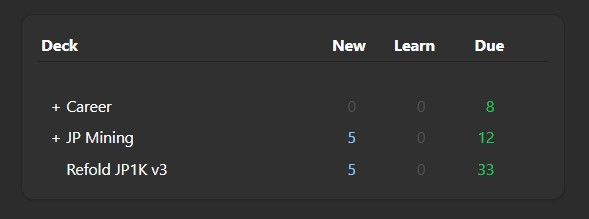
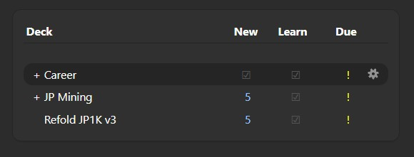

# Hide your dues. Finish those cards.
Sometimes it's best to not know how many cards you have left – just gotta power through all of them 😎

Displays an exclamation mark (**!**) in place of your due reviews. 

⚠️ This **does not hide your remaining cards at the review screen**. Anki has a built-in feature to do that. `Tools` > `Preferences` > `Review` tab > Uncheck `Show remaining card count`

🚧 This addon has not been tested on other versions. Currently works for **Version 25.02**.[^1]

🪛 **Work In Progress**. I currently don't have any plans on maintaining or improving this addon on top of my initial idea. This was mostly just a side project to build my portfolio. If I don't update this, I hope someone takes inspiration \:)

## Vanilla look

## Changes

[^1]: If some of the code looks familiar, that's because I took inspiration or have straight up built on top of them from existing addons xd (thanks AnKing and glutanimate -- addon GOATs)